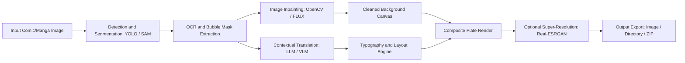

# manga-translator

Automated pipeline for detecting, cleaning, translating, and re-typesetting text in comic and manga page imagery.

## Overview

MangaTranslator is an end-to-end computer vision and natural language processing tool for localized comics. It ingests high-resolution manga and comic pages (`.png`, `.jpg`, `.webp`), segments speech bubbles and outside-bubble text using object detection models, removes source script via targeted inpainting, queries vision-language models for contextual translation across 60+ languages, and renders translated typography with automated font scaling and hyphenation into final rendered plates.

## Architecture and Pipeline

The application executes through a multi-stage sequential processing pipeline.



- Bubble & Text Detection: Input images are analyzed with fine-tuned YOLO or SAM (Segment Anything Model) checkpoints to generate polygon bounding coordinates for speech bubbles and standalone sound effects.
- Masking & Inpainting: Detected text regions are masked out. Text removal is performed using fast bi-harmonic OpenCV telea/ns algorithms or deep diffusion-based inpainting (FLUX / Kontext) depending on texture complexity.
- OCR & Translation: Cropped text segments along with surrounding page context are serialized and sent to translation providers (Google Gemini, OpenAI, Anthropic, DeepSeek, or local OpenAI-compatible endpoints) preserving reading order (right-to-left or left-to-right).
- Typesetting & Font Placement: Translated strings are measured against mask geometry, automatically wrapped, hyphenated, and typeset using assigned font packs (`.ttf`/`.otf`) with dynamic font sizing.
- Post-Processing: Canvas composites are assembled, optionally upscaled using super-resolution models (AnimeSharp / Real-ESRGAN), and written to disk or packaged into archives.

## Tech Stack

| Component | Technology | Description |
| :--- | :--- | :--- |
| Runtime | Python 3.10+ | Core language environment |
| Web UI | Gradio 5.x | Interactive web configuration and preview interface |
| Vision / Models | PyTorch, Ultralytics YOLO, OpenCV | Detection, mask extraction, and image transformations |
| NLP & Translation | Google GenAI, OpenAI API, Anthropic API | Multi-modal OCR and translation engines |
| Typography | Pillow (PIL), FreeType | Font rasterization, bounding box calculations, and text layout |
| Portable Bundle | Windows embedded Python, Git | Standalone self-contained portable runtime |

## Project Structure

```text
MangaTranslator/
├── .env.example              # Translation provider API template
├── .gitignore                # Source control exclusion filters
├── README.md                 # Technical documentation
├── main.py                   # Application entrypoint (CLI and WebUI)
├── core/                     # Processing engine
│   ├── config.py             # Typed dataclass configuration and defaults
│   ├── pipeline.py           # End-to-end translation pipeline coordinator
│   ├── outside_text_processor.py # Detection and masking for outside-bubble text
│   ├── validation.py         # Image, model, and path integrity validators
│   ├── image/                # Image manipulation subroutines
│   │   ├── cleaning.py       # Inpainting routines and color matching
│   │   ├── detection.py      # Bubble segmentation and bounding logic
│   │   └── image_utils.py    # Color space conversions and resizing helpers
│   └── services/             # Upstream API integrations
│       └── translation.py    # LLM prompt construction and response parsing
└── utils/                    # Shared helper functions and endpoint drivers
```

## Setup and Prerequisites

### Prerequisites
- Python 3.10 or higher
- NVIDIA GPU with CUDA support recommended (CPU execution supported with reduced speed)
- API key for at least one supported translation provider (Gemini, OpenAI, Anthropic, or OpenRouter)

### Installation

1. Navigate to the project directory:
   ```bash
   cd c:/Tools/MangaTranslator/MangaTranslator_portable/MangaTranslator
   ```

2. Configure environment variables:
   ```bash
   copy .env.example .env
   ```

3. Open `.env` and configure your API credentials:
   ```ini
   GEMINI_API_KEY=your_gemini_api_key_here
   OPENAI_API_KEY=your_openai_api_key_here
   ```

## Usage Examples

### Launching the Web Interface
Run the application with default settings to launch the Gradio dashboard:
```bash
python main.py
```
The interface will be hosted locally at `http://127.0.0.1:7860/`.

### CLI Batch Processing
To translate a folder of manga pages without a web browser:
```bash
python main.py --cli --input-dir "path/to/raws" --output-dir "path/to/translated" --target-lang "English"
```

### Key Configuration Parameters

| Parameter | Configuration Key | Description |
| :--- | :--- | :--- |
| `provider` | `translation.provider` | Selected LLM provider (`google`, `openai`, `anthropic`, `openrouter`) |
| `model_name` | `translation.model_name` | Specific model identifier (e.g. `gemini-3.8-flash`, `gpt-4o-mini`) |
| `target_lang` | `translation.target_lang` | Output language for speech text |
| `inpaint_mode` | `cleaning.inpaint_mode` | Inpainting algorithm (`opencv`, `flux`) |
| `device` | `system.device` | Execution device (`cuda`, `cpu`, `mps`) |

## Notes and Constraints

- VRAM Requirements: Diffusion-based inpainting (FLUX) and large local vision models require 8GB+ VRAM. For lower resource environments, use `opencv` inpainting combined with cloud LLM endpoints.
- Rate Limiting: High-volume batch operations against cloud APIs may trigger provider concurrency limits. The pipeline employs sequential queue dispatch to respect standard tier thresholds.
- Typography: If specific glyphs or diacritics are missing from the default font, configure a custom Unicode font pack inside the Web UI font settings.
